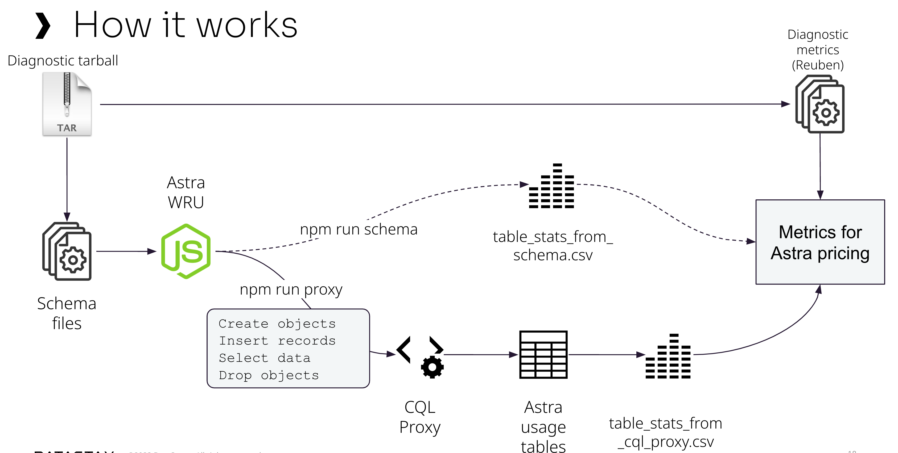

# Astra WRU
NodeJS app to generate writes to tables based on the schema. With this process, the request write sizes for each table can be checked.


<!-- @import "[TOC]" {cmd="toc" depthFrom=1 depthTo=6 orderedList=false} -->


# Motivation

The right write size of the Cassandra workloads is complex to discover. Depending on the case, this lack of this information can cause the estimates to be underestimated.

In cases where it is needed to migrate a big cluster to Astra, doing this analysis consumes a lot of time, and it is hard to be sure of the numbers.

So, in conjunction with the CQL Proxy version that stores the metrics, this app will generate a simulated workload based on schema files to understand the behavior for each table.

# How it works



The first thing is to run CQL Proxy locally. It needed to use the version from [https://github.com/qzg/cql-proxy], which collects the read and write metrics.

The app connected to the local CQL Proxy will read all the schema files from the "schema" folder.

Then, it will create the types and tables for each table.

For each table, the app generates 100 records (this quantity can be changed if needed).

After finishing all tasks, the CQL Proxy stats are collected into a file with the write sizes in the "out" folder.

Tables and Types are dropped from the database.

# How to use it

## Pre-requisites

- An Astra Database and Keyspace specifically for this process. (WARNING: Tables and types are created and dropped all the time, so choose an empty database to use)
- Golang (to build the CQL Proxy)
- NodeJS

## Setting environment variables

Rename the file .env_sample file to .env.

Update the variables with the correct information.

## Starting the CQL Proxy

Clone the git repo from https://github.com/qzg/cql-proxy.

Build it following the instructions available in the readme.

Start it with the following parameters:
- --astra-bundle
- --username
- --password
- --track-usage 
- --usage-keyspace app

The file start-cql-proxy.sh can be used to start the CQL Proxy.

## Installing dependencies

In the app root folder, run:

````
npm install

````

## Running the app

- Place the schemas files in the "schemas" folder

- To run the estimates based on the schema files only, run:

````
npm run schema

````

- To run the estimates based on the cql-proxy metrics, run:

````
npm run proxy

````

- To collect the metrics without processing the schemas, run:

````
npm run metrics

````
## Settings:

Environment Variables:
- ASTRA_CLIENT_ID
- ASTRA_CLIENT_SECRET
- ASTRA_CLIENT_TOKEN
- ASTRA_KEYSPACE = Keyspace to use for object creation
- ASTRA_DC = Astra region
- ASTRA_BUNDLE_LOCATION = Astra SCB file location

Consts.js (To randomize the length of values)

- AVERAGE_STRING_LENGTH[n,n]: String length min and max length
- AVERAGE_SET_LENGTH[n,n]: Arrays 7 Sets  min and max length
- AVERAGE_LIST_LENGTH[n,n]: Lists min and max length
- AVERAGE_BLOB_LENGTH[n,n]: Blob min and max size

Index.js
- NUM_RECORDS: Number of records to write to the tables
- SELECT_LIMIT: Number of records to select:
- TABLES_TO_TEST: When defined, run the estimates for this objects only.

## Results

All the results are available at the out folder:

- table_stats_from_cql_proxy.csv : Table stats based on the simulated workload to Astra
- table_stats_from_schema.csv : Table stats based on the schema structure only
- Logs and errors also available

## Results file:

The table_stats.csv file contains the following columns:

- table_ref: keyspace and table names, separated by a dot
- keyspace
- table
- write_count: Quantity of inserts or updates sent to the table
- write_size: Insert size, in bytes, generated by the commands
- write_wrus: WRU consumed by the inserts and updates
- writes_size: Write size, in bytes
- WRU per record: How many WRUs are consumed per one single insert/update
- RRU per "N" rows: RRUs consumed with one SELECT * FROM table LIMIT "N".
- Rows per RRU: How many records fit in one RRU (4kb) . This information can help understand read requests consumption

## Hints

- If it is needed to run the process multiple times, restart the CQL Proxy. 
- Stats tables are truncated at the beginning of the process.
- Multiple schema files can be processed in one execution. Place them all in the schemas folder.
- Parameters can be changed in the consts file and in the beginning of the index file.

# Next Steps

- Understand the impact of SAI in the write size
- Process diagnostic tarball to extract the metrics
- Infer write and read count when we don't have the diagnostic files.